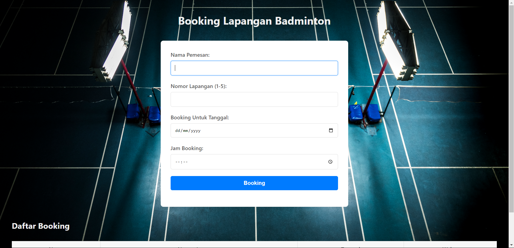

# Booking Lapangan Badminton

Aplikasi **Booking Lapangan Badminton** adalah sebuah aplikasi web sederhana untuk melakukan pemesanan lapangan badminton secara online. Pengguna dapat memilih nomor lapangan, tanggal booking, serta waktu mulai dan berakhir untuk pemesanan. Aplikasi ini juga menampilkan daftar booking yang telah dilakukan.

## Fitur

- Formulir pemesanan lapangan dengan input nama pemesan, nomor lapangan, tanggal, jam mulai, dan jam berakhir.
- Validasi input untuk memastikan pengguna memasukkan data yang benar.
- Daftar booking yang telah dilakukan dengan rincian nama, nomor lapangan, tanggal, dan jam.
- Tampilan responsif dan user-friendly.

## Teknologi yang Digunakan

- **Frontend**: HTML, CSS
- **Backend**: PHP
- **Database**: MySQL

# Lampiran



## Instalasi
1. Clone repository ini ke dalam folder server Anda.
   ```bash
   git clone https://github.com/RafifDwiPrayata/Sistem_Booking_Lapangan_Badminton.git